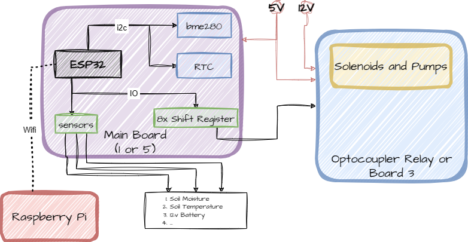
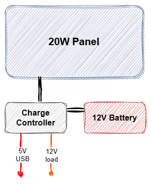

# bewae — Automated Irrigation System v3.3

> Sensor-controlled balcony irrigation using ESP32 & Raspberry Pi. *(v3.3 — work in progress)*

---

## Overview

bewae automates the watering of balcony plants based on configurable schedules. An ESP32 reads soil moisture, temperature, humidity, pressure, and light data, stores it in InfluxDB on a Raspberry Pi, and controls irrigation valves and pumps via a shift register. The system is configured through a web interface served by Node-RED and can run standalone if no network is available.

**Key features:**

- Schedule-based irrigation with per-group timing control
- Sensor data storage and visualization (InfluxDB 2.0 + Grafana)
- Web-based configuration via Node-RED — no re-flashing required
- Solar-powered operation (optional)
- Remote monitoring via VPN (e.g. PiVPN)

---

## System Diagram

| System Setup | Solar Setup |
| :-----------: | :-----------: |
|  |  |

---

## Repository Structure

```text
bewae/
├── code/esp_32ard_bewae/         # ESP32 firmware (PlatformIO)
│   ├── src/                      # Main source files
│   ├── lib/LogFire/              # LogFire logging library (local copy)
│   └── data/                     # Filesystem configs (SPIFFS)
├── code/pi_scripts/              # Raspberry Pi Python scripts
│   ├── calculate_weather_multiplier.py
│   ├── check_soil_moisture.py
│   ├── weather_utils.py          # Shared library
│   └── monitoring_config.JSON    # Credentials and thresholds
├── node-red-flows/               # Node-RED flows for Raspberry Pi
│   └── bewaeConfigPageFlow.json  # Web config page (active)
├── fzz-layout/                   # PCB designs (Fritzing + Gerber)
└── docs/                         # Documentation & images
```

---

## Hardware

| Component | Details |
|---|---|
| Microcontroller | ESP32 (WROOM) |
| Single-board computer | Raspberry Pi 4B (64-bit OS) |
| Sensors | BME280 (temp/humidity/pressure), DS18B20 (soil temp), capacitive soil moisture, LDR |
| Actuators | Up to 10× 12V valves, 1–2× 12V pumps via shift register (74HC595) |
| Power | 20W 12V solar panel, 12Ah lead-acid battery, solar charge controller |

The current supported PCB is **Board 5** (`bewae3_3_board5v5_final.fzz`) — compact main board with onboard I2C + 1-Wire, 2× 5V / 2× 3V sensor slots, LDR, and up to 8 valve/pump outputs expandable via shift register. Gerber files for manufacturing are included in `fzz-layout/`.

---

## Setup

### Prerequisites

- Visual Studio Code with the [PlatformIO IDE](https://platformio.org/) extension
- Raspberry Pi running a 64-bit OS with:
  - [Node-RED](https://nodered.org/docs/getting-started/raspberrypi)
  - [InfluxDB 2.0](https://docs.influxdata.com/influxdb/v2/install/?t=Raspberry+Pi)

---

### 1. ESP32 Firmware

1. Open `code/esp_32ard_bewae/` in VS Code with PlatformIO.
2. Edit `src/connection.h` — set your Wi-Fi credentials, Raspberry Pi IP, InfluxDB token, and NTP server.
3. In `src/config.h`, select the hardware class matching your PCB:

   ```cpp
   #define HW_BOARD Helper_config1_Board5v5
   ```

4. Build and upload the firmware via the PlatformIO toolbar (arrow icon).
5. Upload the filesystem: PlatformIO → **Upload Filesystem Image** (uploads `data/` to SPIFFS).

> If no network is available, the firmware still runs using locally stored config. Time must be set manually via `Helper::set_time()`.

---

### 2. Raspberry Pi — InfluxDB 2.0

1. Visit `http://localhost:8086` and complete initial setup (user, org, bucket).
2. Generate an API token: **Load Data → API Tokens → Generate API Token → Custom** (Write permission).
3. Enter the token and org in `src/connection.h`.

---

### 3. Raspberry Pi — Node-RED

Node-RED runs in Docker. The config file is stored at `/data/bewae/full-config.json` inside the container.

1. Access Node-RED at `http://<Pi-IP>:1880`.
2. Import [`node-red-flows/bewaeConfigPageFlow.json`](node-red-flows/bewaeConfigPageFlow.json) via the Node-RED menu → **Import**.
3. Deploy the flow.

> See [`node-red-flows/Readme.md`](node-red-flows/Readme.md) for API endpoint details and security assumptions.

---

### 4. Raspberry Pi — Pi scripts

The Python scripts in `code/pi_scripts/` compute weather-based watering multipliers and check soil moisture. They POST results to Node-RED, which updates the config.

1. Copy the scripts to the Pi.
2. Edit `monitoring_config.JSON` — set InfluxDB credentials, OpenWeatherMap API key, location, and Node-RED URL.
3. Set up cron jobs to run `calculate_weather_multiplier.py` twice daily and `check_soil_moisture.py` 5 minutes after each.

> See [`code/pi_scripts/Readme.md`](code/pi_scripts/Readme.md) for full config field reference and example crontab entries.

---

## Web Configuration

The web config page is the primary way to configure the system without touching any code or files directly.

**URL:**
```
http://<Pi-IP>:1880/bewae-working
```

The page is served by Node-RED and communicates with the ESP32 via HTTP. Changes made on the web page are saved to `full-config.json` on the Pi; the ESP32 fetches updates automatically on the next wake cycle.

### What you can configure

**Irrigation groups** — each group controls one or more valves/pumps:
- Plant name and active state
- Which output pins (vpins) open which valves
- Water duration (seconds per cycle)
- Watering schedule — a 24-bit timetable where each bit represents one hour of the day

**Sensors** — each sensor entry defines a measurement point:
- Sensor name, measurement field, and mode (see [MANUAL_CONFIGURATION.md](MANUAL_CONFIGURATION.md) for all modes)
- Optional calibration: offset (`add`), scaling factor (`fac`), percentage range (`hlim`/`llim`)

**System switches** — enable or disable subsystems:

- `main` — master on/off
- `irig` — irrigation system enable
- `mssr` — measurement/datalogging enable

### How the config sync works

```
Web page  →  Node-RED saves full-config.json on Pi (Docker volume)
Pi scripts →  POST wm updates to Node-RED (/bewae/update-wm)
ESP32      →  polls Pi via HTTP GET on each wake cycle
           →  updates local SPIFFS copy
           →  runs irrigation and sensing based on current config
```

---

## Images

| V3 (Summer) | V3 (Box) | Main PCB |
| :-----------: | :-----------: | :-----------: |
|  |  |  |

---

## Configuration Reference

For a detailed reference of the JSON config format — irrigation groups, sensor modes, switch fields, and SPIFFS file layout — see [MANUAL_CONFIGURATION.md](MANUAL_CONFIGURATION.md).

---

## Roadmap

See [roadmap.md](roadmap.md)
